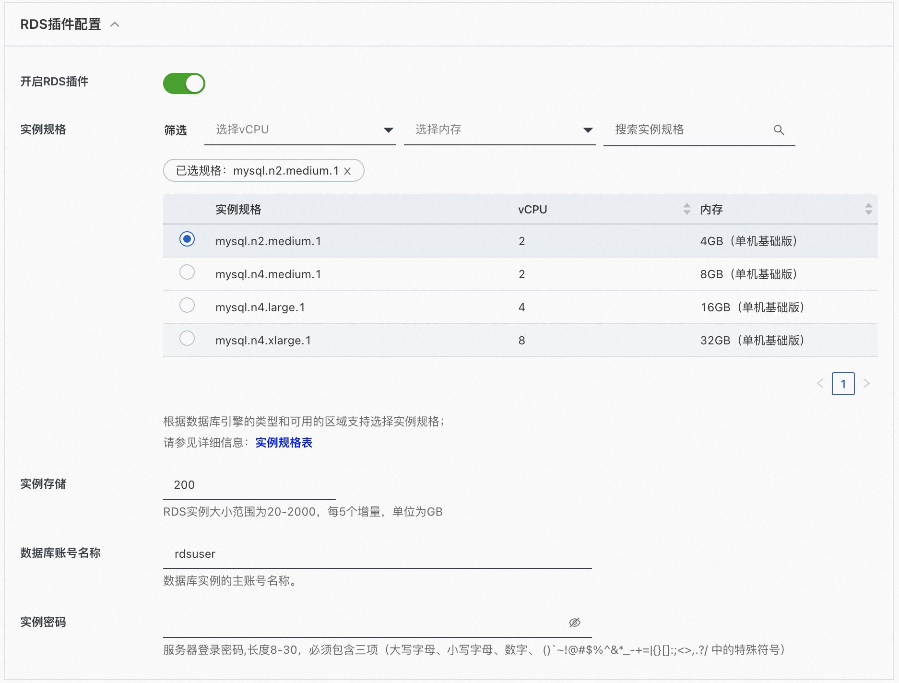
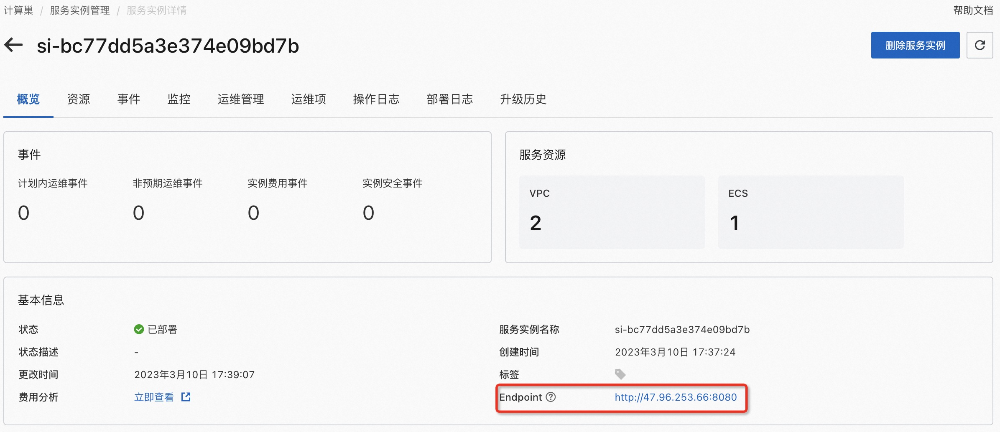

# quickstart-stable-diffusion-aiacctorch服务实例部署文档

>**免责声明：**本服务由第三方提供，我们尽力确保其安全性、准确性和可靠性，但无法保证其完全免于故障、中断、错误或攻击。因此，本公司在此声明：对于本服务的内容、准确性、完整性、可靠性、适用性以及及时性不作任何陈述、保证或承诺，不对您使用本服务所产生的任何直接或间接的损失或损害承担任何责任；对于您通过本服务访问的第三方网站、应用程序、产品和服务，不对其内容、准确性、完整性、可靠性、适用性以及及时性承担任何责任，您应自行承担使用后果产生的风险和责任；对于因您使用本服务而产生的任何损失、损害，包括但不限于直接损失、间接损失、利润损失、商誉损失、数据损失或其他经济损失，不承担任何责任，即使本公司事先已被告知可能存在此类损失或损害的可能性；我们保留不时修改本声明的权利，因此请您在使用本服务前定期检查本声明。如果您对本声明或本服务存在任何问题或疑问，请联系我们。

## 概述
Stable Diffusion Web UI 是一个基于 Stable Diffusion 的基础应用，利用 gradio 模块搭建出交互程序，可以在低代码 GUI 中立即访问 Stable Diffusion。它支持文字生成图片，图片转图片，使用各种各样的模型来达到你想要的效果，还能训练自己的专属模型。本文向您介绍如何开通计算巢上的stable-diffusion服务，以及部署流程和使用说明。

## 计费说明
stable-diffusion在计算巢上的费用主要涉及：

- 所选vCPU与内存规格
- 磁盘容量
- 公网带宽

计费方式包括：

- 按量付费（小时）
- 包年包月

预估费用在创建实例时可实时看到。

## 部署架构
stable-diffusion服务单机部署架构。


## RAM账号所需权限
stable-diffusion服务需要对ECS、VPC等资源进行访问和创建操作，若您使用RAM用户创建服务实例，需要在创建服务实例前，对使用的RAM用户的账号添加相应资源的权限。添加RAM权限的详细操作，请参见[为RAM用户授权](https://help.aliyun.com/document_detail/121945.html)。所需权限如下表所示。

| 权限策略名称 | 备注 |
| --- | --- |
| AliyunECSFullAccess | 管理云服务器服务（ECS）的权限 |
| AliyunVPCFullAccess | 管理专有网络（VPC）的权限 |
| AliyunROSFullAccess | 管理资源编排服务（ROS）的权限 |
| AliyunComputeNestUserFullAccess | 管理计算巢服务（ComputeNest）的用户侧权限 |
| AliyunCloudMonitorFullAccess | 管理云监控（CloudMonitor）的权限 |


## 部署流程
### 部署步骤
单击[部署链接](https://computenest.console.aliyun.com/user/cn-hangzhou/serviceInstanceCreate?ServiceId=service-7c7e05fc6d2b42929821)，进入服务实例部署界面，根据界面提示，填写参数完成部署。

### 部署参数说明
您在创建服务实例的过程中，需要配置服务实例信息。下文介绍stable-diffusion服务实例输入参数的详细信息。

| 参数组     | 参数项    | 示例           | 说明                                                                        |
|---------|--------|--------------|---------------------------------------------------------------------------|
| 服务实例名称  |        | test         | 实例的名称                                                                     |
| 地域      |        | 华东1（杭州）      | 选中服务实例的地域，建议就近选中，以获取更好的网络延时。                                              |
| 可用区配置   | 部署区域   | 可用区I         | 地域下的不同可用区域                                                                |
| 付费类型配置  | 付费类型   | 按量付费 或 包年包月  |
| ECS实例配置 | 实例类型   | ecs.gn6i-c4g1.xlarge | 实例规格，可以根据实际需求选择                                                           |
| ECS实例配置 | 实例密码   | ********     | 设置实例密码。长度8~30个字符，必须包含三项（大写字母、小写字母、数字、()`~!@#$%^&*-+={}[]:;'<>,.?/ 中的特殊符号） |
| 网络配置    | 专有网络IPv4网段  | 192.168.0.0/16     | VPC的ip地址段范围                                                               |
| 网络配置    | 交换机子网网段   | 192.168.0.0/24     | 交换机子网网段                                                                   |
| 登陆信息    | 软件登录名    | admin           | 软件登陆名称                                                                    |
| 登陆信息    | 软件登陆密码   | ********        | 设置实例密码。长度8~30个字符，必须包含三项（大写字母、小写字母、数字、()`~!@#$%^&*-+={}[]:;'<>,.?/ 中的特殊符号） |
| RDS插件配置 | 开启RDS插件  | false           | 是否开启RDS插件，默认不开启，如有需求请设置为true，以下参数需要开启配置后进行设置                              |
| RDS插件配置    | 实例规格     | mysql.n2.medium.1       | RDS实例规格                                                                   |
| RDS插件配置    | 实例存储     | 200           | RDS实例大小范围为20-2000，每5个增量，单位为GB                                             |
| RDS插件配置    | 数据库账号名称    | rdsuser                | 数据库实例的主账号名称                                                               |
| RDS插件配置    | 实例密码     | ********        | 设置实例密码。长度8~30个字符，必须包含三项（大写字母、小写字母、数字、()`~!@#$%^&*-+={}[]:;'<>,.?/ 中的特殊符号） |


 - RDS插件配置说明（需要存储数据时请打开此配置项进行配置）


### 验证结果

1. 查看服务实例。
服务实例创建成功后，部署时间大约需要2分钟。部署完成后，页面上可以看到对应的服务实例。

2. 通过服务实例访问stable-diffusion

3. 进入到对应的服务实例后，点击Endpoint后面的链接,输入第1步设置的软件登录名及密码。

4. 完成验证后即可访问：


### 下载模型
1. 以某模型网站提供的模型为例，首先此模型网站，找到自己想要下载的模型（预览图左上角显示模型的类型）

2. 点击一个模型预览图进入详情页，找到Download按钮点击右键，复制链接地址：

3. 在计算巢控制台点击运维管理，点击“下载模型”，输入相关参数（选择模型或预览图、模型类型、下载方式、文件类型，输入模型名称）：

4. 在计算巢控制台点击运维管理，点击“下载模型”，输入相关参数（选择模型或预览图、模型类型、下载方式、文件类型，输入模型名称）：
    - CHECKPOINT模型示例:
    
    - Lora模型示例:
    
    - 注意：CHECKPOINT、LORA、VAE三种方式不需要输入存储目录，其他模型可在模型类型选择“OTHER”, 自行修改文件存储目录:
    
5. 参数输入完成后，点击下一步,点击创建，开始下载

6. 等待下载完成（等待过程中也可以继续下载其他模型），当执行状态变为成功，表示已经下载完成

7. 此时可以登录到WebUI加载下载的模型
    - CHECKPOINT模型示例，点击上面的刷新按钮，就可以看到我们刚刚下载的CHECKPOINT模型
    
    - Lora模型示例，点击右面Lora按钮，然后点击Refresh，此时就可以看到我们刚刚下载的Lora模型
    
8. 在这里我们可以看到，直接下载模型的没有预览图的，此时可以通过上述下载方式自行上传一张图片到模型文件中，这里以上传本地文件的Lora模型预览图为例。

9. 以此点击确定、创建，等待执行状态变为成功。再次点击Refresh,可以看到，预览图也已经加载出来啦！


### 下载插件
1. 在服务实例运维管理页点击下载插件

2. 输入下载插件的链接，点击下一步

3. 确认参数后可以看到已生成的下载执行，等待执行完成后表示插件下载完成


## 节约成本
### ECS节约成本
GPU资源费用较高，使用完毕后可以通过下述两种方式来节省成本：
1.若只是暂时不使用了可以在运维管理页面选择关机（节省停机模式）【确保前面快速启动步骤1中选择的是按量付费类型】，此时部分资源会被回收并停止收费，以降低相关费用、节约使用成本，下次使用再进行开机，操作如下：

- 关机：

- 等待关机结束：

- 开机：

- 等待开机结束：

2.若彻底不再使用了可以直接将服务实例删除，后续就不会再产生费用


### RDS节约成本
参加运营活动，2核4G基础版新用户首购只要8.8元/月


1. 参与基本规则：活动期间，用户可以通过活动页面享受活动优惠，具体优惠信息以活动页面为准，原则上5折以下特价商品，不再与其他活动或优惠叠加。
2. 产品新用户专享规则：折扣适用于未购买过此商品的用户，新用户折扣不与其他活动或优惠叠加使用，折扣同一用户限首次首件，退订后将不支持再次参加活动；
3. 除特殊情况外，用户参加本活动购买的产品/提货券，不支持退订。如因特殊原因发生退订的，退订前需交回通过本活动所享受的相关权益，例如：补足差价、交回奖品等；


## 高级功能
### 集群版
#### 背景

针对于多人共同使用出图的场景下，stable diffusion webui会排队出图的问题，计算巢推出了集群版stable diffusion快速部署的功能。

#### 适用场景：

- 固定配置场景下的多人webui出图多场景，目的在于多机提速
- API调用集成的场景

#### 主要功能：

- 支持一键部署
- 支持弹性扩缩容
- 支持多机负载均衡调用
- 支持下载模型、下载插件等常用运维功能

#### 架构说明：

- 基于NAS做ECS间的共享存储，用于存放webui的配置、模型、插件功能
- 基于SLB负载均衡做多机流量的转发，对于多用户使用的场景，开启slb会话保持功能，对于api调用的场景下关闭会话保持
- 基于ESS弹性伸缩做ecs的动态扩缩容功能，默认需要手动扩缩容，如果有需要可以配置按cpu/gpu负载的动态扩缩容
- NAT网关做集群的外网流量访问出口


#### 部署集群：

- 登录阿里云计算巢控制台，进入Stable Diffusion服务创建界面，根据界面提示，模版选择gpu集群版，填写相关参数后点击确认订单。


#### 扩容集群

- 部署完成后点击详情进入服务实例详情页，在运维管理中，点击截图所示位置可以选择弹性扩缩容功能。

- 输入实例扩容数后点击确定即可完成机器扩容，还可以到对应的伸缩组中，按监控负载完成自动的弹性扩缩容


### API访问
通过计算巢创建的Stable Diffusion默认开启了API访问，您可以通过API调用来更好地集成我们的服务。
通过上述步骤4中获取的Endpoint+/docs# 可以看到所有可访问的API列表，如访问 http://48.xxx.xx.163:8080/docs# 可以看到

以下是一个通过Python调用Stable Diffusion API的示例：
```
import requests
import io
import base64
from PIL import Image, PngImagePlugin

if __name__ == '__main__':
    url = "http://48.xxx.xx.163:8080"
    payload = {
        "prompt": "puppy dog",
        "steps": 5
    }
    token = "admin:password"
    encoded_token = base64.b64encode(token.encode("utf-8")).decode("utf-8")
    headers = {
        "Content-Type": "application/json",
        "Authorization": f'Basic {encoded_token}'
    }
    response = requests.post(url=f'{url}/sdapi/v1/txt2img', json=payload, headers=headers)
    r = response.json()
    for i in r['images']:
        image = Image.open(io.BytesIO(base64.b64decode(i.split(",", 1)[0])))
        png_payload = {
            "image": "data:image/png;base64," + i
        }
        response2 = requests.post(url=f'{url}/sdapi/v1/png-info', json=png_payload)
        pnginfo = PngImagePlugin.PngInfo()
        pnginfo.add_text("parameters", response2.json().get("info"))
        image.save('output.png', pnginfo=pnginfo)

```
更多API访问信息可查看[API访问向导](https://github.com/AUTOMATIC1111/stable-diffusion-webui/wiki/API#api-guide-by-kilvoctu)了解

### 通过RDS保存生成配置
1. 勾选 Save to DB（勾选即代表需要将生成结果存储到RDS中）
2. 点击 Generate，图片生成完毕后，结果自动存储至 RDS


现在这些关键数据已经保存到RDS了，接下来我们看一下如何查询刚刚保存的数据，一共有两种方式：
1. 通过服务界面查询数据。启用RDS插件之后，会有一个额外的Images页面，其中会显示已经保存到RDS的图片以及相应参数。点击Refresh刷新列表，点击Download将图片下载到本地

2. 还可以直接连接到RDS数据库查询数据。连接方式如下:
SD"服务资源"中点击RDS

筛选出RDS实例，点击实例ID跳转到RDS详情页：

点击"登录数据库", 输入之前创建时RDS MySQL的登陆名和密码：


找到存放在RDS里的AIGC默认的库表： stable_diffusion.generated_images。

我们使用SD产生的数据都在这里啦，保存prompt是非常实用的功能，写的一大串prompt都存储在RDS里可拿出来复用，同时即使GPU服务器资源释放了，所有AIGC的相关数据都不会丢失，数据才是核心资产嘛。
另外熟悉的SQL的小伙伴们可以SELECT一波统计分析下，还可利用阿里云ETL服务将RDS数据抽取到大数据里分析，实现数据永远在线，数据价值不断放大。
此外，再附上generated_images 表各个字段的注释（数据库：stable_diffusion数据表：generated_images ）
```
CREATE TABLE `generated_images` (
  `id` int PRIMARY KEY AUTO_INCREMENT,     /*id*/
  `prompt` text,													 /*图片生成的 prompt */
  `negative_prompt` text,									 /*图片生成的 negative_prompt */
  `steps` varchar(255) DEFAULT NULL,       /*图片生成的 steps */
  `seed` varchar(255) DEFAULT NULL,        /*图片生成的 seed */
  `sampler` varchar(255) DEFAULT NULL,     /*图片生成的 sampler */
  `cfg_scale` varchar(255) DEFAULT NULL,   /*图片生成的 cfg_scale */
  `size` varchar(255) DEFAULT NULL,        /*图片生成的 size，例如 512x512 */
  `model_hash` varchar(255) DEFAULT NULL,  /*图片生成的 model 的 hash 值 */
  `model` varchar(255) DEFAULT NULL,       /*图片生成的 model */
  `image_base64` mediumtext,               /*图片数据，base64格式 */
  PRIMARY KEY (`id`)
) ENGINE=InnoDB DEFAULT CHARSET=utf8mb4 COLLATE=utf8mb4_0900_ai_ci
```

## 帮助文档
请访问[stable-diffusion使用文档](https://github.com/wangwangbobo/stable-diffusion-webui)了解如何使用。
