# Stable Diffusion AIACC加速版部署

>**免责声明：**本服务由第三方提供，我们尽力确保其安全性、准确性和可靠性，但无法保证其完全免于故障、中断、错误或攻击。因此，本公司在此声明：对于本服务的内容、准确性、完整性、可靠性、适用性以及及时性不作任何陈述、保证或承诺，不对您使用本服务所产生的任何直接或间接的损失或损害承担任何责任；对于您通过本服务访问的第三方网站、应用程序、产品和服务，不对其内容、准确性、完整性、可靠性、适用性以及及时性承担任何责任，您应自行承担使用后果产生的风险和责任；对于因您使用本服务而产生的任何损失、损害，包括但不限于直接损失、间接损失、利润损失、商誉损失、数据损失或其他经济损失，不承担任何责任，即使本公司事先已被告知可能存在此类损失或损害的可能性；我们保留不时修改本声明的权利，因此请您在使用本服务前定期检查本声明。如果您对本声明或本服务存在任何问题或疑问，请联系我们。

## 概述
stable diffusion可以通过使用文字生成图片，在整个pipeline中，包含CLIP或其他模型从文字中提取隐变量；通过使用UNET或其他生成器模型进行图片生成。通过逐步扩散(Diffusion)，逐步处理图像，使得图像的生成质量更高。**通过本文，客户可以搭建一个stable diffusion的webui框架，并使用aiacctorch加速图片生成速度。在512x512分辨率下，AIACC加速能将推理性能从1.91s降低至0.88s，性能提升至2.17倍，同时AIACC支持任意多LORA权重加载，且不影响性能。**
aiacctorch支持优化基于Torch框架搭建的模型，通过对模型的计算图进行切割，执行层间融合，以及高性能OP实现，大幅度提升PyTorch的推理性能。您无需指定精度和输入尺寸，即可通过JIT编译的方式对PyTorch框架下的深度学习模型进行推理优化。具体详见[手动安装AIACC-Inference（AIACC推理加速）Torch版](https://help.aliyun.com/document_detail/317822.html)。


## 计算巢实例创建

### 创建实例
访问[计算巢实例](https://computenest.console.aliyun.com/user/cn-hangzhou/recommendService)，点击创建
**Stable diffusion AIACC加速社区版。**
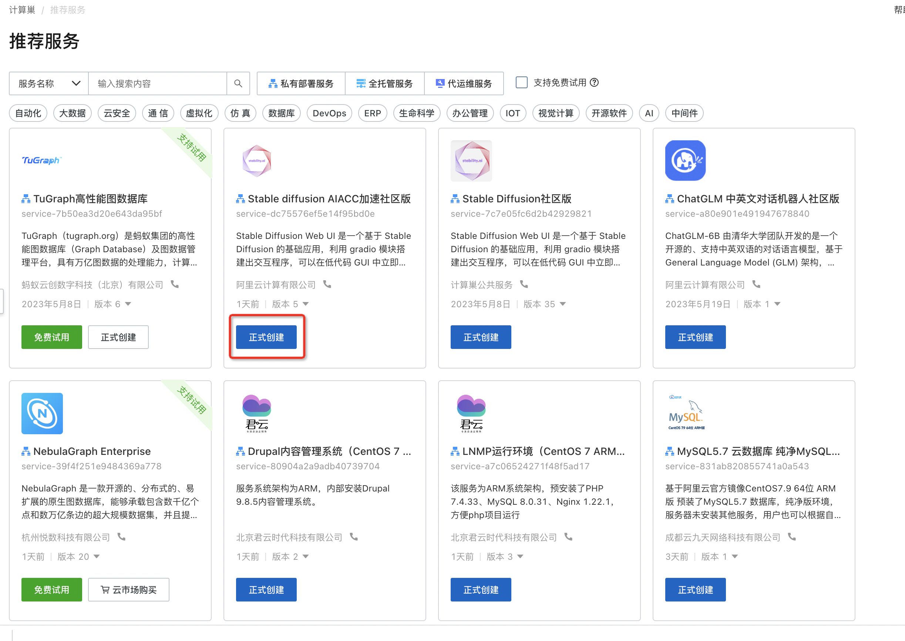
选择所需地域:
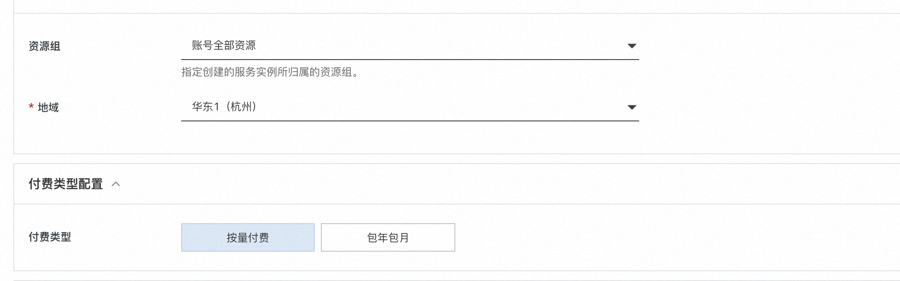
勾选实例类型，并填写实例密码：
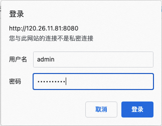
填写登录用户名和密码，用户名和密码在后续登录webui时使用:

点击下一步:确认订单，并勾选服务条款，点击创建：

稍等片刻，等待部署完成。

## 执行图片生成测试

### 登录页面
点击计算巢控制台中的实例:
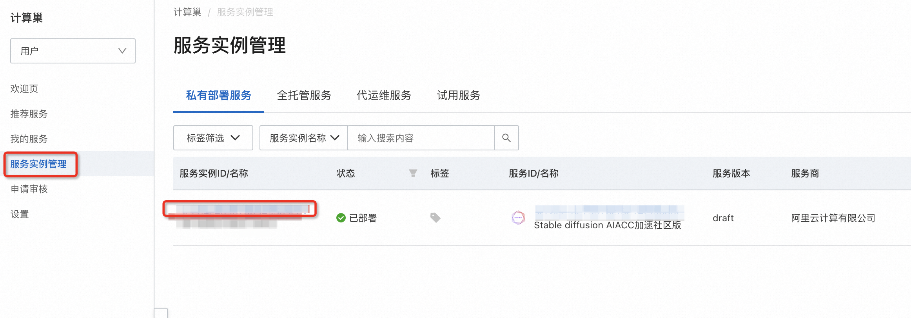
点击其中的endpoint网址：
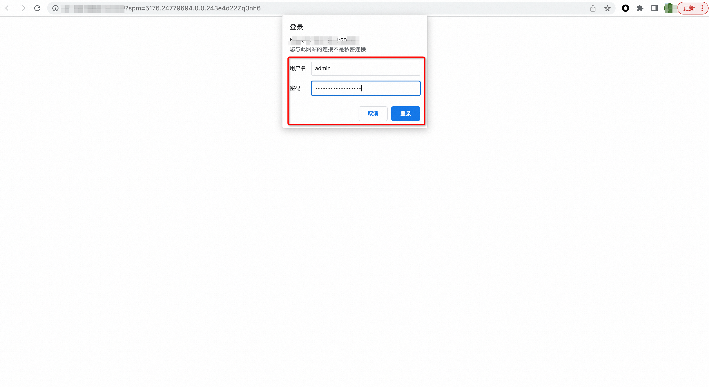
### 测试
输入登录信息中的用户名和密码登录:

进入测试页面:

输入中文prompt，例如:
```bash
铁马冰河入梦来，概念画，科幻，玄幻，3D
```
点击生成，即可生成如下图片：
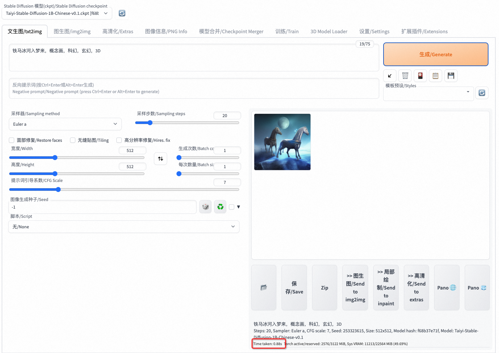

此处我们使用了aiacctorch加速了模型，可以看到单张图片推理时间为**0.88s**。**(注意，首次应用aiacctorch进行图片生成，或者切换模型后的首次图片生成，会多占用30s时间，以进行aiacctorch模型加载)。**
### 模型切换
在上述的模型下载过程中，我们下载了3个模型:

- Taiyi-Stable-Diffusion-1B-Chinese-v0.1：中文Stable Diffusion模型
- Taiyi-Stable-Diffusion-1B-Anime-Chinese-v0.1：中文Stable Diffusion动漫模型
- v1-5-pruned-emaonly.safetensors：Stable Diffusion v1.5模型

我们可以根据输入文字以及生成图片风格，切换模型进行模型推理，例如我们可以通过左上侧的选项卡，选择Taiyi-Stable-Diffusion-1B-Anime-Chinese-v0.1模型：
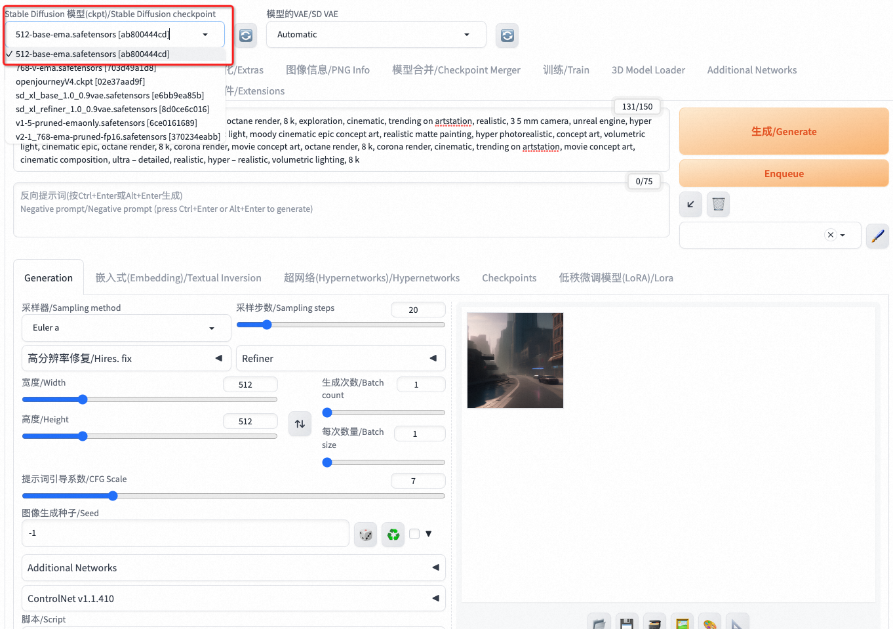
而后输入提示词和反向提示词:
```bash
1个女孩,绿眼,棒球帽,金色头发,闭嘴,帽子,看向阅图者,短发,简单背景,单人,上半身,T恤
Negative prompt: 水彩,漫画,扫描件,简朴的画作,动画截图,3D,像素风,原画,草图,手绘,铅笔
```
则可生成如下图所示的动漫风格图像:
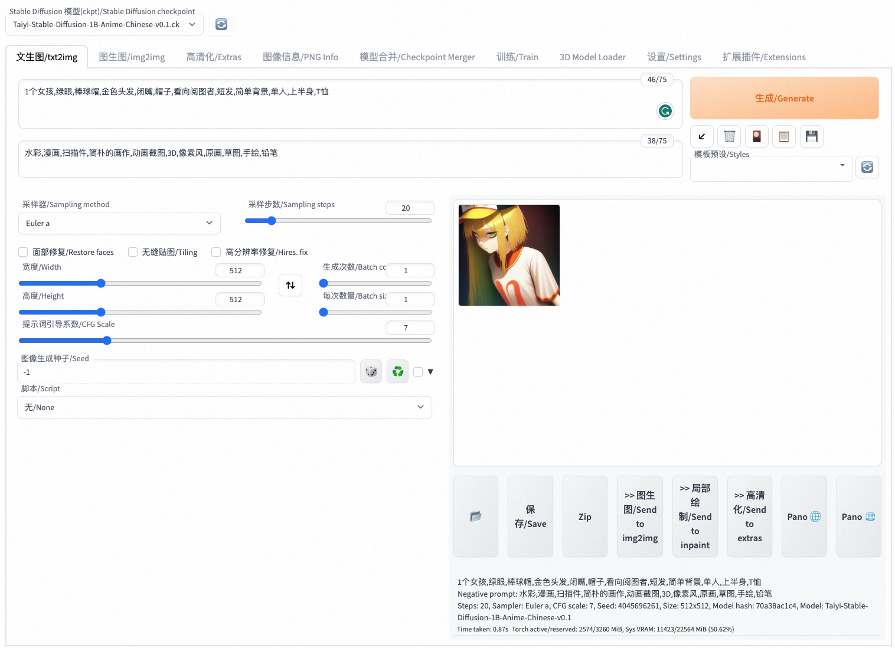
### LORA功能试用
aiacctorch支持LORA加速，可以在prompt中加入LORA支持文本:  <lora:iuV35.uv1P:1>
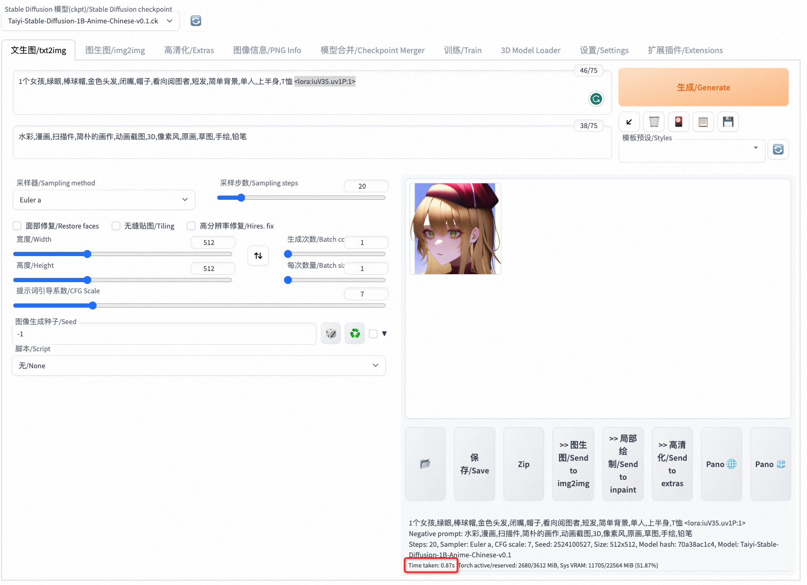
可见在aiacctorch加速优化下，LORA加载后性能与加载前相同。

### Controlnet功能试用
Controlnet可以帮助我们生成与原始图相似风格或相似布局的图片，这里以canny为例介绍controlnet功能。
打开Controlnet选项卡，选择controlType为Canny，并上传一张图片，以LENA图为例，进行如下设置：

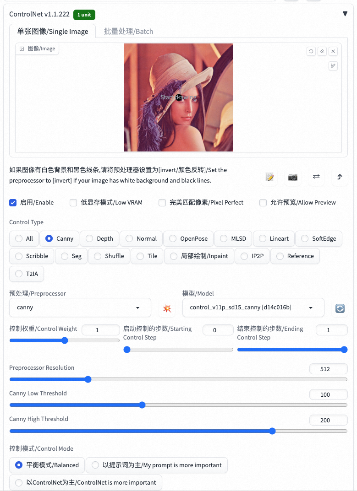

点击生成：

可见性能为2.36s。

### 禁用AIACC加速
我们也可以在settings中禁用aiacctorch。点击settings选项卡，选中aiacctorch，去掉"Apply Aiacctorch in Unet to speedup the whole network inference when loading models"前方的勾，而后点击应用设置：
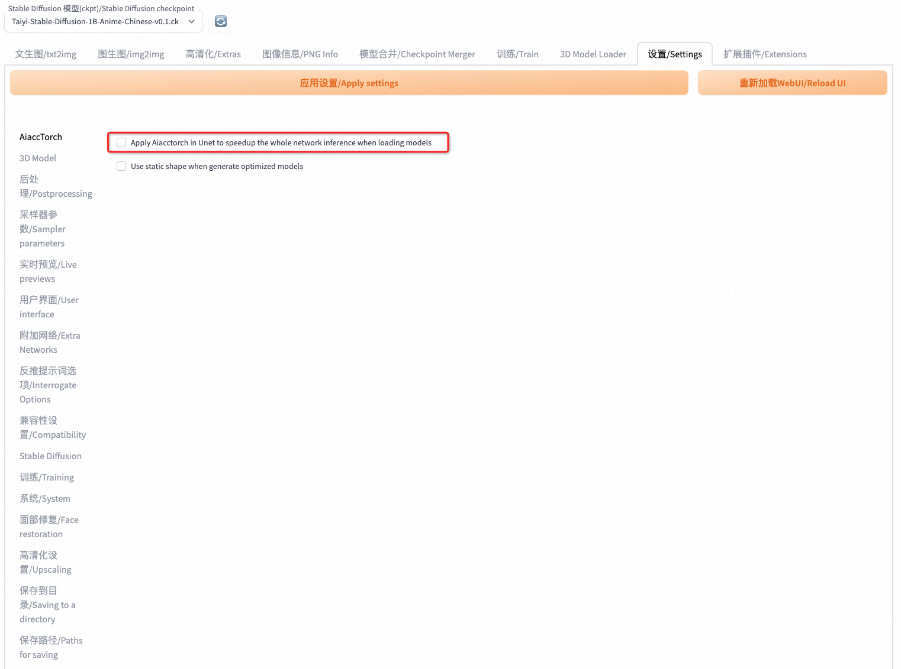

重复图片生成操作，可见推理时间为**1.97s**：
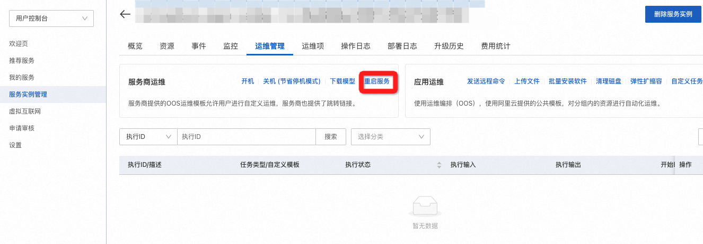

禁用AIACC后，我们也可增加LORA权重进行推理，得到耗时为**2.35s**，大幅高于AIACC优化后的延迟，AIACC加速可达**2.67倍**:


## 推理性能数据汇总
以下是在A10上使用webUI测得的AIACC同pytorch的性能比例，注：以下数据为关闭了生成图输出到文件的过程
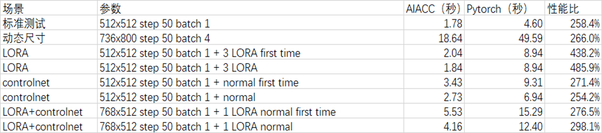


## 模型finetune
仅使用预训练的权重的模型，只能生成预训练数据集相似的物体。若希望生成自定义的物体，可以通过finetune自定义物体图片，使得模型生成所对应物体的图片。

1. 安装sd_dreambooth_extension。
   1. 首先进入开启的实例的终端下载组件，进入终端步骤：进入第二节登录页面展示的服务实例管理的页面，点击相应的服务实例ID，进入该实例的页面，然后点击资源。
      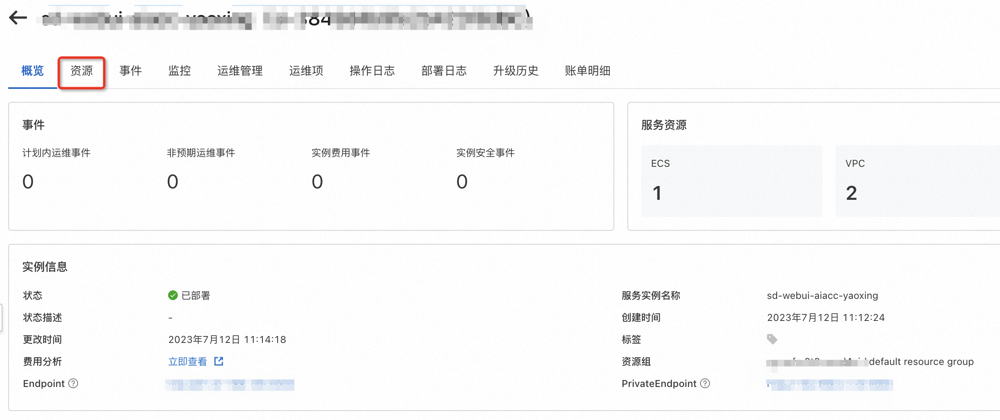

   2. 在资源页面中点击远程连接：
   

   3. 开启会话管理，点击免密登录，
   

   4. 进入终端后，切换成root用户： 
      ```python
      sudo su
      ```
      
   5. 下载如下git链接，并将该项目放到路径/root/stable-diffusion-webui/extensions中，若git clone速度较慢，使用代理：将下面的git链接改成[https://ghproxy.com/https://github.com/d8ahazard/sd_dreambooth_extension.git](https://ghproxy.com/https://github.com/d8ahazard/sd_dreambooth_extension.git)。【阿里云不对您在镜像上使用的第三方模型的合法性、安全性、准确性进行任何保证，并不对由此引发的任何损害承担责任；您应自觉遵守在镜像上安装的第三方模型的用户协议、使用规范和相关法律法规，并就使用第三方模型的合法性、合规性自行承担相关责任。】
      ```python
      https://github.com/d8ahazard/sd_dreambooth_extension.git
      ```
   6. 安装完成后，/root/stable-diffusion-webui/extensions文件夹下包含sd_dreambooth_extension文件夹，然后执行如下命令：
      ```python
      pip install tensorflow
      wget https://aiacc-training.oss-cn-hangzhou.aliyuncs.com/yaoxing/train_dreambooth.py -O /root/stable-diffusion-webui/extensions/sd_dreambooth_extension/dreambooth/train_dreambooth.py 
      wget https://ali-perseus-release.oss-cn-huhehaote.aliyuncs.com/sd_utils/utils.py -O /root/stable-diffusion-webui/extensions/sd_dreambooth_extension/dreambooth/utils/utils.py
      wget https://ali-perseus-release.oss-cn-huhehaote.aliyuncs.com/sd_utils/image_utils.py -O /root/stable-diffusion-webui/extensions/sd_dreambooth_extension/dreambooth/utils/image_utils.py
      wget https://ali-perseus-release.oss-cn-huhehaote.aliyuncs.com/sd_utils/log_parser.py -O /root/stable-diffusion-webui/extensions/sd_dreambooth_extension/helpers/log_parser.py
      wget https://aiacc-training.oss-cn-hangzhou.aliyuncs.com/yaoxing/compiler.py -O /workspace/miniconda/lib/python3.10/site-packages/triton/compiler.py
      ```
   7. 执行完命令后，按照第二节流程点击endpoint进入页面，选择扩展插件按钮对插件进行调整（**若未发现sd_dreambooth_extension插件可点击重启用户界面的按钮**），将sd_dreamboooth_extension插件勾选，并取消LoRA/Lora插件勾选（sd_dreamboooth_extension中自带lora），**训练完成后进行推理时，需要设置回原来的配置（即取消sd_dreamboooth_extension插件勾选，并勾选LoRA/Lora插件）**。
   

   8. 之后可在终端输入命令重启服务然后重新点击endpoint进入服务：

      - systemctl stop sdwebui 
      - systemctl start sdwebui 

   9. 上述步骤完成后，此时若界面中出现Dreambooth选项，则说明安装成功：
   

2. 点击DreamBooth按钮进入Dreambooth finetune界面，并点击Create按钮进入模型创建界面，输入待生成的模型权重名称和生成权重的来源(已经预先准备了一个权重v1-5-pruned-emaonly.safetensors [6ce0161689])，然后点击Create按钮生成模型权重：


3. 生成模型权重后，点击Select按钮，选择之前生成的模型权重。选择Input中的Settings按钮进行训练参数选择，勾选Use LORA按钮，并调整训练的迭代次数epoch（默认为100，可根据实际需要调整）和训练数据的batch size（一般设为1或2）。若希望finetune流程快一些，可将Save Model Frequency (Epochs)和“Save Preview(s) Frequency (Epochs)”选项调大(如果设置的值较小会导致finetune时间较长并且不稳定)，不超过最大的epoch数(=迭代次数epoch x 图片数量N)即可。
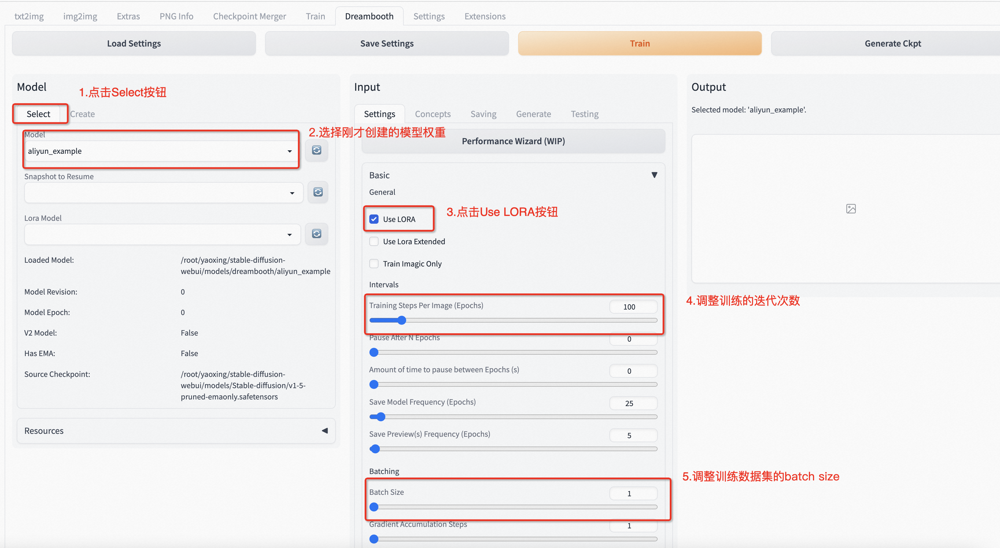

4. 将页面继续往下拉，取消Gradient Checkpointing的勾选，在Optimizer中选择AdamW，Mixed Precision选择fp16或者no，Memory Attention选择xformers或者no（当Precision选fp16时才能选择xformers）。
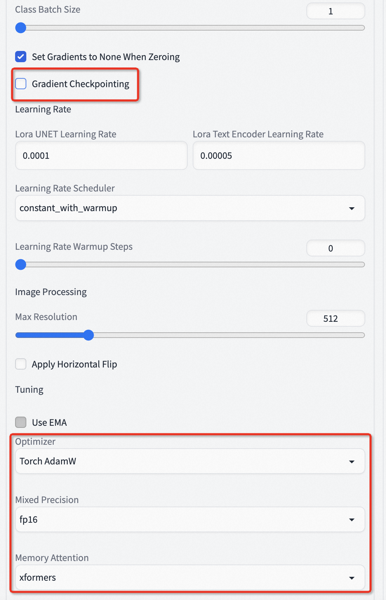

5. 之后点击Concepts按钮，进入训练数据集选择。在Dataset DIrectory中填入ECS服务器中的数据集路径(需要将数据集提前上传至服务器当中，同一物体的图片即可，也可以下载[https://ghproxy.com/https://github.com/google/dreambooth.git](https://ghproxy.com/https://github.com/d8ahazard/sd_dreambooth_extension.git)中的图片进行试用)，Instance Prompt中填入对数据集物体的描述(输入可以简单设为“a <物体名称> <物体类别>”。如云小宝公仔的Instance Prompt为“a yunxiaobao doll”)，在Class Prompt中填入数据集物体的类别(输入可以简单设为“a <物体类别>”，如云小宝公仔的Class Prompt为“a doll”)，在Sample Image Prompt中填入和Instance Prompt一致的内容。
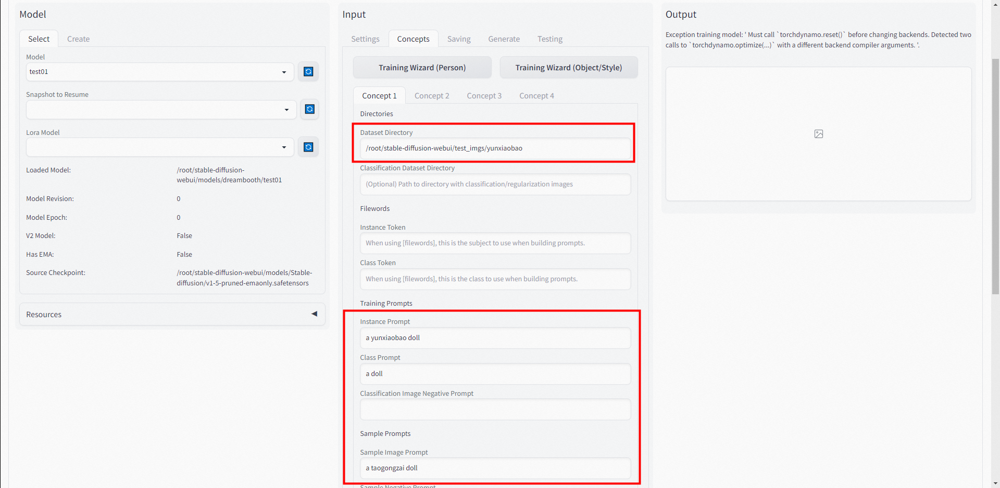

6. 填完上述信息后，点击Train按钮对我们的数据集进行Finetune（第一次运行可能会出现数据集路径错误的提示，重跑一次即可），训练完成后会在Output界面显示：


### 图片生成
#### 1. Dreambooth
finetune完成后，可以通过一些文字生成特定物体的图像（下文流程与第二节推理流程一致）。首先需要**取消sd_dreamboooth_extension插件勾选，并勾选LoRA/Lora插件，然后点击重启按钮：**


然后输入命令重启服务：

   - systemctl stop sdwebui 
   - systemctl start sdwebui 

点击Stable DIffusion checkpoint中的刷新按钮，然后从Stable DIffusion checkpoint中的下拉框中选择之前finetune好的模型权重，并点击txt2img按钮，在Prompt框中输入之前finetune使用的Instance Prompt的内容，然后点击右侧的Generate按钮，即可生成对应的物体图片：


若选择finetune前的权重，生成的图片如下：


用于finetune的原图片如下图所示，可见finetune后的模型能够很好地生成所需图片，而finetune前的模型则无法生成所需要的云小宝玩偶图片：


#### 2.Dreambooth + 新的prompt
通过修改Prompt可以对特定的物体添加不同的装饰和背景。例如，将“a yunxiaobao doll”改成“a yunxiaobao doll wearing a red hat”，可以生成戴着红帽子的云小宝玩偶：


### 性能提升
|  | eager                                                                                                                                                                                                                                                                                                                                                                                  | agspeed |
| --- |----------------------------------------------------------------------------------------------------------------------------------------------------------------------------------------------------------------------------------------------------------------------------------------------------------------------------------------------------------------------------------------| --- |
| ecs.gn7i-c32g1.32xlarge 4卡A10 + 4pictures + 200epoch | 
 | 
 |

从上表可以看出，加入[AIACC-AGSpeed](https://help.aliyun.com/document_detail/468651.html)后，在a10上finetune4张图片，200epoch，并且将“Save Model Frequency (Epochs)”选项和“Save Preview(s) Frequency (Epochs)”设置成1000以减少文件保存对时间统计的影响，训练性能提升了18%(e2e的时间提效果没有训练时间显著是由于e2e除了训练流程外还有其他的流程，同时agspeed刚开始编译需要消耗一定的时间)。如果想要获取极致的加速性能，可在webui界面处将“Training Steps Per Image (Epochs)”选项调大一些(默认100，可调成200或更高)。
“Save Model Frequency (Epochs)”选项和“Save Preview(s) Frequency (Epochs)”选项设置如下：


## F&Q

### 如何重启服务
- 可使用如下命令停止服务:
```shell
systemctl stop sdwebui 
```
- 可使用如下命令打开服务:
```shell
systemctl start sdwebui
```
### 如何查看log
```shell
cat /var/log/sdwebui.log
```
### 出现AttributeError: 'NoneType' object has no attribute 'loaded_loras'怎么解决
如果使用dreambooth库，则会导致内置的lora模块失效，则会出现如下问题:
### 

需要解决这个问题，请关闭sd_dreambooth_extension：

而后应用并重启界面，
然后重启服务：
```python
systemctl stop sdwebui
systemctl start sdwebui
```
### 如何设置服务进程退出后自动重启

- 修改/lib/systemd/system/sdwebui.service，将Restart设置成always，则服务进程异常退出后会立刻重启。


### 如何预编译模型

- aiacctorch通过编译优化的方式进行模型加速。当切换模型时，aiacctorch也会同步编译模型。如果我们希望将已有的模型全部进行编译，则可以通过webui的切换模型的api进行。
- 请注意，切换模型时请确保webui已经打开，由于webui是单进程模式，单个机器请执行单个切换模型的操作。
```python
#!/usr/bin/env python3
# -*- coding: utf-8 -*-
"""
Created on Wed May 24 11:13:15 2023

@author: lyuniqi
"""

import requests
import random
import base64

ip_address = "http://localhost:5001"


url_option = ip_address + "/sdapi/v1/options"
url_sd_models = ip_address + "/sdapi/v1/sd-models"
url_txt2img = ip_address + "/sdapi/v1/txt2img"

models = [x['title'] for x in requests.get(url_sd_models).json()]

def change_option(model_name):
    print(f"change to {model_name}")
    option = {"sd_model_checkpoint":model_name}
    requests.post(url_option, json=option)

for model in models:
    change_option(model)
```
### 如何保存预编译模型
预编译模型放置在~/.cache/aiacctorch/eng_models/当中，如果需要将预编译模型放置在其他位置，则可使用软链接的方式进行。例如将预编译模型放置在/root/prebuild_models:
```bash
#新建文件夹
mkdir -p /root/prebuild_models
#移动目录
mv ~/.cache/aiacctorch/* /root/prebuild_models
#创建软链接
rm  ~/.cache/aiacctorch/ && ln -s /root/prebuild_models ~/.cache/aiacctorch/
```

